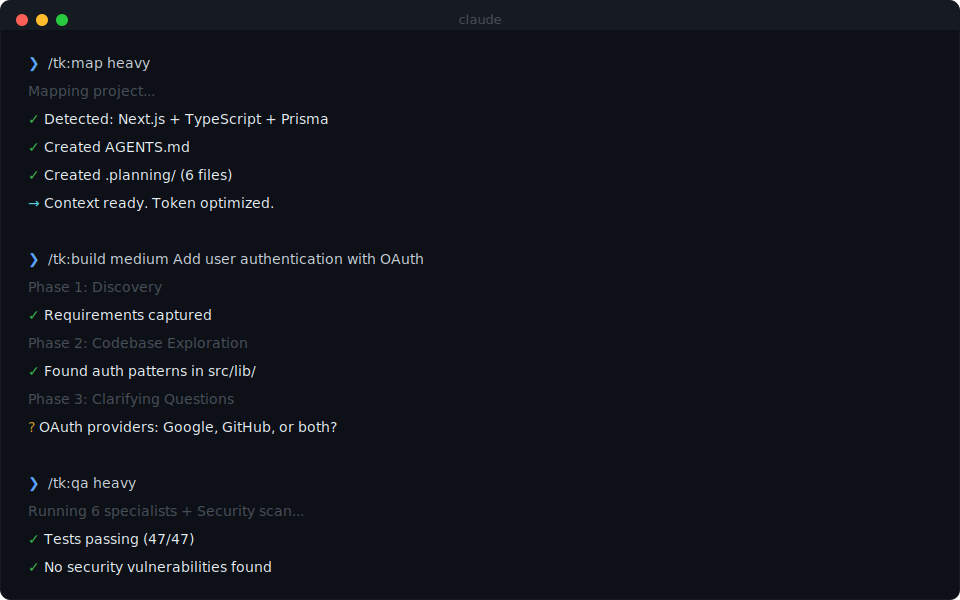

<div align="center">

# TK

**Token-optimized commands for Claude Code**

*Named "Token Killer" because it kills token waste, not your tokens. We're saving lives out here.*

<br>



<br>

</div>

---

## Why This Exists

AI coding tools burn through tokens fast. Most prompts are bloated with redundant instructions, verbose documentation, and unnecessary context. When your context window fills up, Claude starts forgetting things and producing worse code. This is **context rot**.

The best AI coding workflows—[Get Shit Done](https://github.com/glittercowboy/get-shit-done), [Ralph](https://github.com/snarktank/ralph), Anthropic's official plugins—are genuinely excellent. But they're written for readability, not efficiency.

**TK fixes that.** It takes the best patterns from 5 different systems, strips the redundancy, and delivers the same power with less overhead.

---

## Install

**NPM (recommended):**
```bash
npx tk-claude-skill
```

**One-line install:**
```bash
curl -fsSL https://raw.githubusercontent.com/colbywest5/tk-Claude-Skill/main/install.sh | bash
```

**Manual:**
```bash
git clone https://github.com/colbywest5/tk-Claude-Skill.git
cd tk-Claude-Skill
cp tk.md ~/.claude/commands/
cp -r commands/ ~/.claude/commands/tk/
```

Then restart Claude Code and run `/tk:help`.

---

## Commands

<div align="center">


</div>

<br>

### Core Workflow

| Command | What it does |
|---------|--------------|
| `/tk:map` | **Run this first.** Scans your codebase, creates `AGENTS.md` with project context, sets up `.planning/` directory. |
| `/tk:build` | Builds features using a 7-phase workflow: Discovery → Exploration → Questions → Architecture → Implementation → Review → Summary |
| `/tk:qa` | Tests your code with security vulnerability scanning for injection, XSS, secrets, and more. |
| `/tk:deploy` | Deploys with pre-flight checks and post-deploy verification. Auto-rollback on failure. |

### Quality & Maintenance

| Command | What it does |
|---------|--------------|
| `/tk:debug` | Systematic debugging. Hypothesis testing, auto-revert on failures, escalation when stuck. |
| `/tk:review` | Code review with 4 parallel reviewers. Only reports high-confidence issues. |
| `/tk:clean` | Removes dead code, unused deps, console.logs. Refactors for clarity. |
| `/tk:design` | Creates distinctive frontend interfaces—unique typography, bold colors, no AI slop. |

### Analysis & Utilities

| Command | What it does |
|---------|--------------|
| `/tk:opinion` | **Honest project audit.** Asks questions, then gives direct feedback on architecture, code quality, dependencies, testing, docs, and MVP progress. |
| `/tk:doc` | Generates README, API docs, architecture diagrams, inline comments. |
| `/tk:init` | Scaffolds new projects with your preferred stack and tooling. |
| `/tk:resume` | Picks up where you left off if interrupted. |
| `/tk:learn` | Captures gotchas, patterns, and decisions. |
| `/tk:status` | Quick health check: git, tests, types, build. |
| `/tk:tokens` | Shows token usage estimates. |
| `/tk:help` | Shows all commands. |

---

## Modes

Every command supports three modes:

| Mode | When to use | What happens |
|------|-------------|--------------|
| `light` | Quick fixes, simple tasks | Fast, minimal questions, no SubAgents |
| `medium` | Standard features | Balanced, 2-3 questions, structured |
| `heavy` | Complex features | Full workflow, parallel SubAgents + DOCS |

```bash
/tk:build light    # Just build it
/tk:build medium   # Ask questions, then build
/tk:build heavy    # Full 7-phase with parallel agents
```

---

## `/tk:opinion` — Project Audit

Get honest, actionable feedback on your project:

```bash
/tk:opinion medium
```

**What it checks:**
- Architecture — Is the structure sensible? Any anti-patterns?
- Code Quality — Consistency, dead code, error handling
- Dependencies — Bloat, security issues, outdated packages
- Testing — Coverage, meaningful tests, CI integration
- Documentation — Can someone new get started?
- MVP Progress — How far off are you? Any scope creep?

**What you get:**
- What's working (specific praise)
- What's not working (direct feedback)
- What to stop doing (time wasters)
- What to start doing (high-impact changes)
- Hot takes (things you might not want to hear)

---

## Heavy Mode SubAgents

When using `heavy` mode, TK spawns specialized SubAgents in parallel:

| Command | SubAgents |
|---------|-----------|
| `map` | 6 mappers + DOCS |
| `build` | 3 explorers → 3 architects → 3 reviewers + DOCS |
| `opinion` | 4 auditors (architecture, code, deps, DX) + DOCS |
| `design` | 3 researchers + 4 specialists + DOCS |
| `debug` | 4 investigators + 3 fixers + DOCS |
| `qa` | 6 specialists (security, edge cases, perf, a11y) + DOCS |
| `review` | 4 reviewers + DOCS |
| `deploy` | 4 pre-flight + 4 post-deploy + DOCS |

---

## `/tk:build` — 7-Phase Workflow

| Phase | What happens |
|-------|--------------|
| 1. Discovery | Understand requirements, create task list |
| 2. Exploration | Trace existing patterns, identify key files |
| 3. Questions | **Mandatory.** Resolve all ambiguities before design |
| 4. Architecture | Multiple approaches → trade-offs → you choose |
| 5. Implementation | Build with approval, follow conventions |
| 6. Review | Check bugs, quality, conventions (≥80% confidence) |
| 7. Summary | Document what was built |

---

## `/tk:qa` — Security Scanning

| Vulnerability | What TK checks |
|---------------|----------------|
| Command injection | `exec()`, `child_process`, `os.system()` |
| Code injection | `eval()`, `new Function()` |
| XSS | `innerHTML`, `dangerouslySetInnerHTML` |
| Secrets | Hardcoded passwords, API keys |
| Dependencies | `npm audit` vulnerabilities |
| GitHub Actions | `${{ }}` injection in workflows |

---

## MCP Integration

TK supports the Model Context Protocol:

```json
{
  "mcpServers": {
    "tk": {
      "command": "npx",
      "args": ["tk-claude-skill", "--mcp"]
    }
  }
}
```

See [mcp/README.md](mcp/README.md) for details.

---

## Files Created

```
AGENTS.md              # Project knowledge base
.planning/
├── STATE.md           # Current work state
├── HISTORY.md         # Work log
├── ISSUES.md          # Known issues
├── PATTERNS.md        # Discovered patterns
├── DECISIONS.md       # Decisions with rationale
├── CODEBASE.md        # File map
└── ARCHITECTURE.md    # System design
```

---

## Credits

Built from patterns in:

| Source | Contribution |
|--------|--------------|
| [Get Shit Done](https://github.com/glittercowboy/get-shit-done) | Context engineering, multi-agent orchestration |
| [Ralph](https://github.com/snarktank/ralph) | Autonomous loops, fresh context patterns |
| [feature-dev](https://github.com/anthropics/claude-code/tree/main/plugins/feature-dev) | 7-phase workflow, specialized agents |
| [security-guidance](https://github.com/anthropics/claude-code/tree/main/plugins/security-guidance) | Vulnerability scanning |
| [frontend-design](https://github.com/anthropics/claude-code/tree/main/plugins/frontend-design) | Distinctive UI principles |

---

## Contributing

PRs welcome.

## License

MIT
